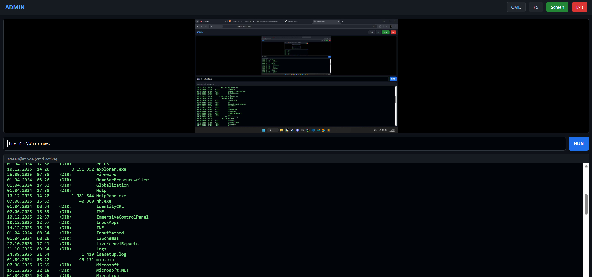
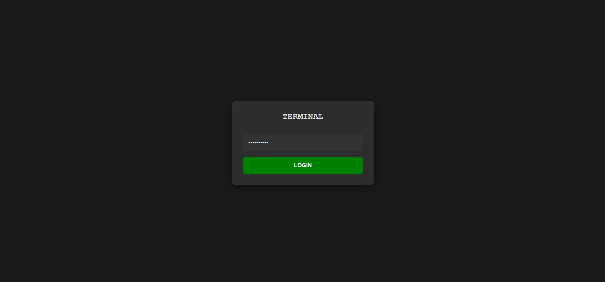
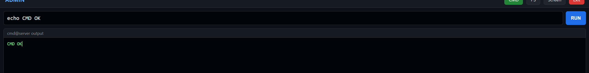
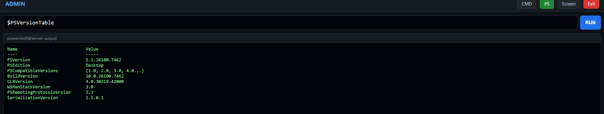

# SilentPort

**⚠️ Note:** This is a **test and work-in-progress** project. Features, security, and interface are not fully finished and will be improved in future updates.

---

## Description
A web-based administrative panel built with Flask, providing a multi-functional interface for remote system management, including command execution, PowerShell access, and real-time screen monitoring. The project also integrates with a Telegram bot for remote server status notifications.

---

## Key Features

### 1. Login System
- Secure password-protected login page.
- Session-based authentication for dashboard access.

### 2. Command Execution (CMD)
- Web-based terminal to execute system commands remotely.
- Supports standard CMD commands on Windows and shell commands on other OS.

### 3. PowerShell Access
- Dedicated web page for executing PowerShell commands.
- Full command output display.

### 4. Real-Time Screen Monitoring
- Live streaming of the server’s primary monitor.
- Adjustable frame capture quality and frame rate.

### 5. Telegram Integration
- Telegram bot reports public IP and server status.
- Receive remote notifications and quick access information.

### 6. Technical Details
- Built with Flask and Python.
- Uses `subprocess` for command execution and `mss` + `PIL` for screen capture.
- Multi-threaded design for simultaneous web and bot operations.
- Responsive interface with three main pages: CMD, PowerShell, and Screen Viewer.

---

## Web Pages
1. **Login Page**: Secure authentication entry.
2. **CMD Page**: Enter and run system commands.
3. **PowerShell Page**: Run PowerShell commands with output.
4. **Screen Viewer**: Live view of server screen in real-time.

---

## Use Case
Designed for administrators to remotely manage servers or workstations in a secure and efficient way, with both web and Telegram-based remote monitoring capabilities.

---

## Notes
- This project is **not production-ready**.
- Security, performance, and interface improvements are planned in future updates.
- Intended only for testing, learning, and demonstration purposes.

---

## Demo / Screenshots

### Login Page

### CMD Page

### PowerShell Page

### Screen Viewer

